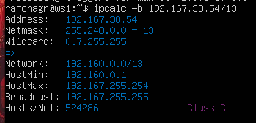
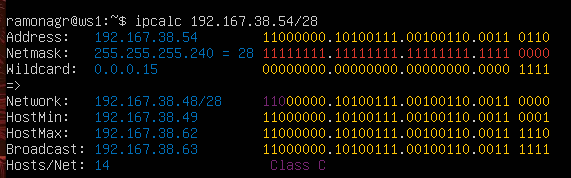
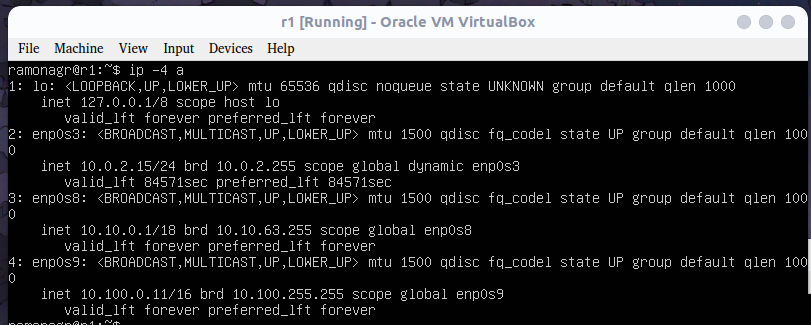
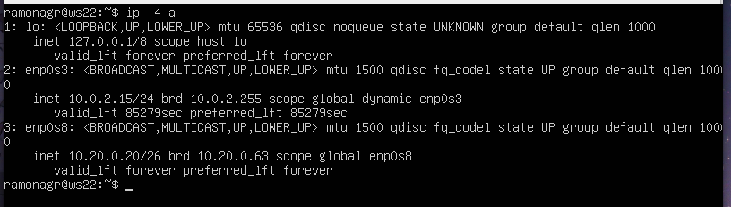

# Сети в Linux

Основная цель проета настройка сетей в Linux на виртуальных машинах согласно рисунку ниже. Изучена статическая маршрутизация сети, динамическая настройка IP с помощью DHCP и основные сетевые утилиты.


## Part 1. Инструмент ipcalc
**1.1. Сети и маски** 
 - 1) Адрес сети 192.167.38.54/13. <br>
 `Введём команду ipcalc -b 192.167.38.54/13`  
   
 Флаг `-b` позволяет скрыть двоичный вывод.

 - 2) Перевод маски 255.255.255.0 в префиксную и двоичную запись, /15 в обычную и двоичную, 11111111.11111111.11111111.11110000 в обычную и префиксную <br>
 `Введём команду ipcalc 255.255.255.0` <br>
    
 Префиксная - 24; <br>
 Двоичная 11111111.11111111.11111111.00000000 . <br>
 `Введём команду ipcalc /15` <br>
   
 Обычная - 255.254.0.0; <br>
 Двоичная 11111111.11111110.00000000.00000000 . <br>
 `Введём команду ipcalc 192.167.38.54/28` <br>
  <br>
 Обычная - 255.255.255.0; <br>
 Префиксная 28 - количество не нулевых битов. <br>

 - 3) Минимальный и максимальный хост в сети 12.167.38.4 при масках: /8, 11111111.11111111.00000000.00000000, 255.255.254.0 и /4  <br>
 - `Введём команду ipcalc 12.167.38.4/8` <br>
  <br>
 Минимальный хост - 12.0.0.1 <br>
 Максимальный хост - 12.255.255.254 <br>
 - `Введём команду ipcalc 12.167.38.4/16` <br>
  <br>
 Минимальный хост - 12.167.0.1 <br>
 Максимальный хост - 12.167.255.254 <br>
 - `Введём команду ipcalc 12.167.38.4/255.255.254.0` <br>
  <br>
 Минимальный хост - 12.167.38.1 <br>
 Максимальный хост - 12.167.39.254 <br>
 - `Введём команду ipcalc 12.167.38.4/4` <br>
  <br>
 Минимальный хост - 0.0.0.1 <br>
 Максимальный хост - 15.255.255.254 <br>

**1.2. localhost**  
`Определить и записать в отчёт, можно ли обратиться к приложению, работающему на localhost, со следующими IP: 194.34.23.100, 127.0.0.2, 127.1.0.1, 128.0.0.1`

 - Везде, где мы видим, когда ipcalc выводит "Loopback" в разделе "hosts/net", это означает, что анализируемая подсеть является частью петлевой подсети, которая обычно используется для внутренних тестов и диагностики на устройстве.
 Вывод можно только к 127.0.0.2, 127.1.0.1  

  <br>
  <br>

**1.3. Диапазоны и сегменты сетей** <br>
 - `1) Какие из перечисленных IP можно использовать в качестве публичного, а какие только в качестве частных: 10.0.0.45, 134.43.0.2, 192.168.4.2, 172.20.250.4, 172.0.2.1, 192.172.0.1, 172.68.0.2, 172.16.255.255, 10.10.10.10, 192.169.168.1`

 - Если в строке "Hosts/Net" есть надпись "Private Internet", то ip адрес принадлежит частной сети.  
 
  <br>
  <br>
  <br>
  <br>
 - Публичные - 134.43.0.2, 172.0.2.1, 192.172.0.1, 172.68.0.2, 176.16.255.255,      192.169.168.1 <br>
 - Частные - 10.0.0.45, 192.168.4.2, 172.20.250.4, 10.10.10.10

 - `2)  Какие из перечисленных IP адресов шлюза возможны у сети 10.10.0.0/18: 10.0.0.1, 10.10.0.2, 10.10.10.10, 10.10.100.1, 10.10.1.255`
  <br>
 - Возможны: 10.10.0.2, 10.10.10.10, 10.10.1.255 <br>

## Part 2. Статическая маршрутизация между двумя машинами
 - С помощью команды ip a вывожу существующие сетевые интерфейсы на ws1 и ws2.<br>
  <br>
 
 - Cетевой интерфейс, соответствующий внутренней сети, на обеих машинах и следующие адреса и маски: ws1 - ```192.168.100.10```, маска /16, ws2 - ```172.24.116.8```, маска /12. <br>

 - Скрины с содержанием изменённого файла ```etc/netplan/00-installer-config.yaml``` для ```ws1``` и ```ws2``` <br>
  <br>
 
 - Команда netplan apply для перезапуска сервиса сети. <br>
  <br>
 
 **2.1. Добавление статического маршрута вручную** 
 - Статический маршрут от одной машины до другой и обратно при помощи команды вида ```ip r add``` <br>
  <br>
  <br>
 - Пинг соединение между машинами <br>
  <br>
  <br>

 **2.2 Добавление статического маршрута с сохранением**

 - Перезапуск машин
```reboot```

 - Добавление статического маршрута от одной машины до другой с помощью файла ```etc/netplan/00-installer-config.yaml```
 
 

 - Пинг соединение между машинами ```ws1```, ```ws2```
 
  

## Part 3. Утилита iperf3
 
**3.1. Скорость соединения**
- Перевод:
 - 8 Mbps = 1 MB/s (1 MB = 8 Mb)
 - 100 MB/s = 819200 Kbps (1 byte = 8 bit, 1 KB = 1024 bytes, 1 MB/s = 1000 KB/s. 100 MB/s * 1000 KB/MB * 1024 bytes/KB * 8 bits/byte = 819200000 byte/s)
 - 1 Gbps = 1000 Mbps (1 Gb = 10^3 Mb)

**3.2. Утилита iperf3**

- Скорость соединения между ws1 и ws2


## Part 4. Сетевой экран

**4.1. Утилита iptables**

- Содержание файла /etc/firewall для каждой машины.

  

- Запуск файлов на обеих машинах командами chmod +x /etc/firewall.sh и /etc/firewall.sh.

  

- Если сначала стоит запрещающее правило, то оно имеет приоритет перед последующим разрешающим.

**4.2. Утилита nmap**

- Командой ping найдена машина, которая не «пингуется», после чего утилитой nmap показано, что хост машины запущен.

  

  

  

## Part 5. Статическая маршрутизация сети

**5.1. Настройка адресов машин**

- Настройка конфигурации машин в etc/netplan/00-installer-config.yaml

  

  

  

  

  

- ```sudo netplan apply``` для всех машин для применения конфига 

- проверка ip ```ip -4 a```

  

  

  

  

  

- Пинг ws22 с ws21. Аналогично пинг r1 с ws11.

  

  

**5.2. Включение переадресации IP-адресов**

- Для включения переадресации IP, выполнил команду на роутерах: ```sysctl -w net.ipv4.ip_forward=1```

  

- Изменил файл ```/etc/sysctl.conf``` и добавил в него следующую строку:
```net.ipv4.ip_forward = 1```. При использовании этого подхода, IP-переадресация включена на постоянной основе.

  

  

**5.3. Установка маршрута по-умолчанию**

- Настройка маршрута по-умолчанию (шлюз) для рабочих станций. Для этого добавил ```default``` перед IP роутеров в файлах конфигураций etc/netplan/00-installer-config.yaml.

  

  

  


- Вызов ```ip r``` и показ, что добавился маршрут в таблицу маршрутизации.

  

  

  

- Пинг с ```ws11``` роутер ```r2``` используя ```tcpdump -tn -i eth*```

  

  

**5.4. Добавление статических маршрутов**

- Добавил в роутеры ```r1``` и ```r2``` статические маршруты в файле конфигураций. Скрины с содержанием изменённого файла ```etc/netplan/00-installer-config.yaml``` для каждого роутера.

  

  


- Вызов ```ip r``` с маршрутами на обоих роутерах.

  

- Запуск команды на ```ws11```: ```ip r list 10.10.0.0/[маска сети]``` и ```ip r list 0.0.0.0/0```

  


- Выводы отличаются, потому что в случае с маршрутом до сети ```10.10.0.0/18``` машине не нужно обращаться к роутеру, она и так находится в этой сети.

  - ```0.0.0.0/0``` - это немаршрутизируемый адрес IPv4, который можно использовать в разных целях, в основном, в качестве адреса по умолчанию или адреса-заполнителя.

**5.5. Построение списка маршрутизаторов**

- Запуск на r1 команду дампа: ```tcpdump -tnv -i eth0```. При помощи утилиты ```traceroute``` построен список маршрутизаторов на пути от ```ws11``` до ```ws21```.

  

- Утилита ```Traceroute``` формирует UDP-датаграмму (сообщение, которое нужно доставить целевому серверу), упаковывает ее в IP-пакет и передаёт первому транзитному узлу. В заголовке такого IP-пакета есть поле TTL (Time To Live) — время жизни пакета. Оно определяет количество хопов, через которые пакет может пройти.


**5.6. Использование протокола ICMP при маршрутизации**

- Запустил на r1 перехват сетевого трафика, проходящего через eth0 с помощью команды:
```tcpdump -n -i eth0 icmp```

- Пропинговал с ```ws11``` несуществующий IP (например, 10.30.0.111) с помощью команды:
```ping -c 1 10.30.0.111```

  


## Part 6. Динамическая настройка IP с помощью DHCP

- Для ```r2``` настроим в файле ```/etc/dhcp/dhcpd.conf``` конфигурацию службы ```DHCP```:

- 1) Укажем адрес маршрутизатора по-умолчанию, DNS-сервер и адрес внутренней сети.

  

- 2) В файле ```resolv.conf``` прописал ```nameserver 8.8.8.8```.

  

- Перезагрузил службу DHCP командой ```systemctl restart isc-dhcp-server```. Машину ```ws21``` перезагрузил при помощи ```reboot``` и через ```ip``` a показываю, что она получила адрес. Также 

  

  

- Пинг ```ws22``` с ```ws21```.

  
  

- Указал MAC адрес у ```ws11```, для этого в ```etc/netplan/00-installer-config.yaml``` добавил строки: ```macaddress: 10:10:10:10:10:BA, dhcp4: true.```

  

Для r1 настроил аналогично r2, но сделал выдачу адресов с жесткой привязкой к MAC-адресу (ws11). Провел аналогичные тесты.

  ```etc/netplan/00-installer-config.yaml```

  

  ```resolv.conf```

  

  ```systemctl restart isc-dhcp-server```

  

  Машину ```ws11``` перезагрузил при помощи ```reboot``` и через ```ip``` a показываю, что она получила адрес. 

  


Запроси с ```ws21``` обновление ip адреса.

  ip до:

  

  ip после:

  

- Использовал dhclient -r и dhclient -v для выдачи нового ip.
- Сохранил дампы образов виртуальных машин.


## Part 7. NAT

- установил apache2 ```sudo apt install apache2``` на ws22 и r1

- в файле /etc/apache2/ports.conf на ws22 и r1 изменил строку Listen 80 на Listen 0.0.0.0:80, то есть сделал сервер Apache2 общедоступным.

  

  


- Запустил веб-сервер Apache командой ```service apache2 start``` на ws22 и r1.

  

  

- Добавил в фаервол, созданный по аналогии с фаерволом из Части 4, на r2 следующие правила:

- 1) Удаление правил в таблице filter - iptables -F;

- 2) Удаление правил в таблице "NAT" - iptables -F -t nat;

- 3) Отбрасывать все маршрутизируемые пакеты - iptables --policy FORWARD DROP.

  

- Запустил файл также, как в Части 4.

  

- Проверил соединение между ws22 и r1 командой ping. При запуске файла с этими правилами, ws22 не должна «пинговаться» с r1.

  

- 4) Разрешил маршрутизацию всех пакетов протокола ICMP.

  

- Запустил файл также, как в Части 4.

  

- Проверил соединение между ws22 и r1 командой ping. При запуске файла с этими правилами, ws22 должна «пинговаться» с r1.

  


- Добавил в файл ещё два правила:

- 5) Включил SNAT, а именно маскирование всех локальных ip из локальной сети, находящейся за r2 (по обозначениям из Части 5 - сеть 10.20.0.0).

- 6) Включил DNAT на 8080 порт машины r2 и добавил к веб-серверу Apache, запущенному на ws22, доступ извне сети.

  

- Запустил файл также, как в Части 4. Перед тестированием отключил сетевой интерфейс NAT.

  

- Проверил соединение по TCP для SNAT: для этого с ws22 подключился к серверу Apache на r1 командой: telnet [адрес] [порт]

  

- Проверил соединение по TCP для DNAT: для этого с r1 подключился к серверу Apache на ws22 командой telnet (обращался по адресу r2 и порту 8080).

  

- Сохранил дампы образов виртуальных машин.

## Part 8. Дополнительно. Знакомство с SSH Tunnels

- Запустил на r2 фаервол с правилами из Части 7.

  

- Установил ssh (sudo apt install ssh) на ws22, ws21, ws11
- Разрешил подключение по shh на ws22 в /etc/ssh/sshd_config

  

- Перезапустил веб-сервер Apache на ws22 после внесения правок в /etc/apache2/ports.conf (localhost:80).
  

  

- Воспользовался Local TCP forwarding с ws21 до ws22, чтобы получить доступ к веб-серверу на ws22 с ws21.
  

- Воспользовался Remote TCP forwarding c ws11 до ws22, чтобы получить доступ к веб-серверу на ws22 с ws11.
  

- Для проверки, сработало ли подключение, перешел во второй терминал (клавишами Alt + F2) и выполнил команду:
telnet 127.0.0.1 [локальный порт]

- 

- Сохранил дампы образов виртуальных машин.
